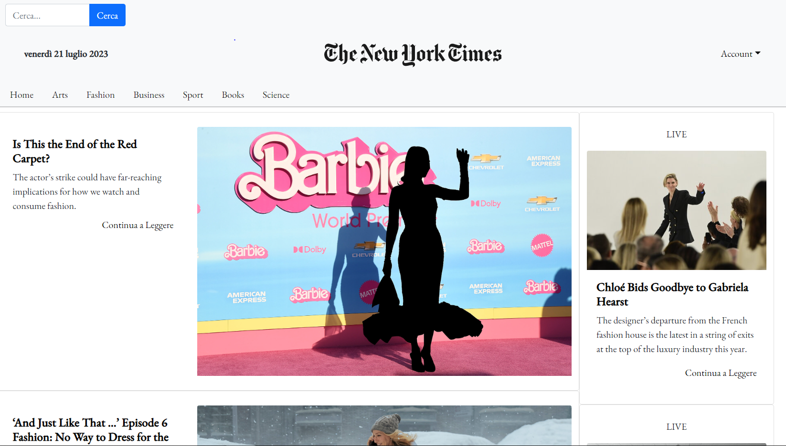

# New York Times - Homepage

Copia della Home page del sito ufficiale del New York Times

> Demo dal vivo [_qui_](https://newyorktimesclone.netlify.app/). <!-- Se hai il progetto ospitato da qualche parte, includi il link qui. -->

## Sommario

- [Informazioni generali](#informazioni-generali)
- [Tecnologie utilizzate](#tecnologie-utilizzate)
- [Screenshot](#screenshot)
- [Utilizzo](#utilizzo)
- [Stato progetto](#stato-progetto)
- [Ringraziamenti](#riconoscimenti)
- [Contatto](#contatto)
- [Licenza](#licenza)

## Informazioni generali

Questo sito è stato creato prendendo spunto dal sito ufficiale del New York Times.
E' stato strutturato usando React e gestendo lo state tramite Redux.

## Tecnologie utilizzate

- Html
- Css
- Bootstrap
- Javascript
- React
- Redux
- Visual Studio Core ( editor )
- GitHub

## Screenshot

Screenshoot della’applicazione al suo valore iniziale

## Utilizzo

- Essendo un clone del sito ufficiale del New York Times , questo sito permette
  di tenersi aggiornato sulle notizie di tutto il mondo grazie al servizio API del [New York Times](https://developer.nytimes.com/).
- Offre anche la possibilità di ricercare le notizie nel loro Database tramite parole chiave.

## Stato del progetto

Il progetto è completato.

## Ringraziamenti

Questo progetto è stato svolto per Start2Impact per valutare le mie skills con React.

## Contatto

Creato da [Alessandro Aglianò](https://alessandroagliano.github.io/)- non esitare a contattarmi!

## Licenza -->

Questo progetto è open source e disponibile sotto la Mit License.
